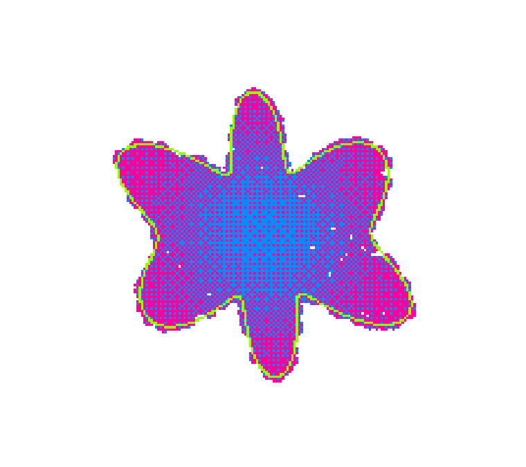
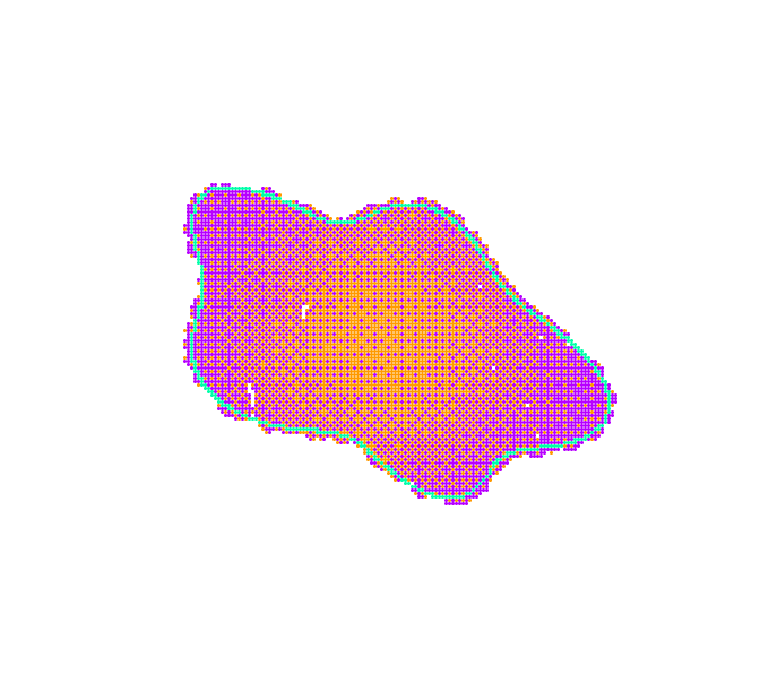
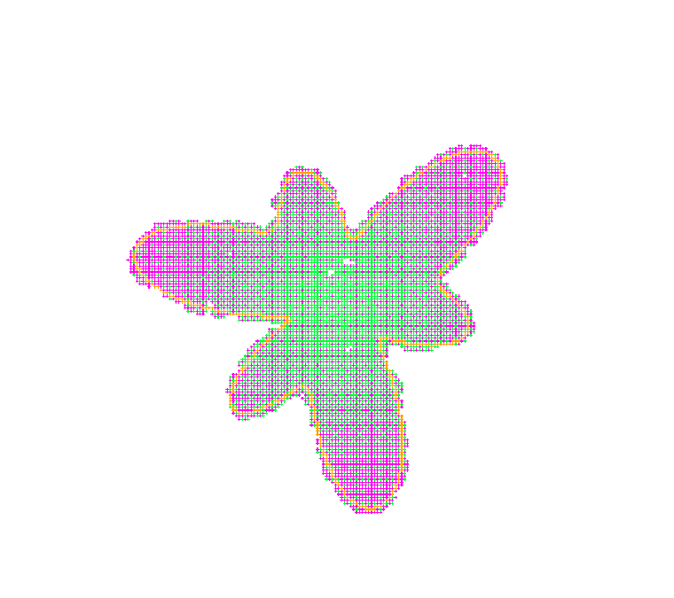
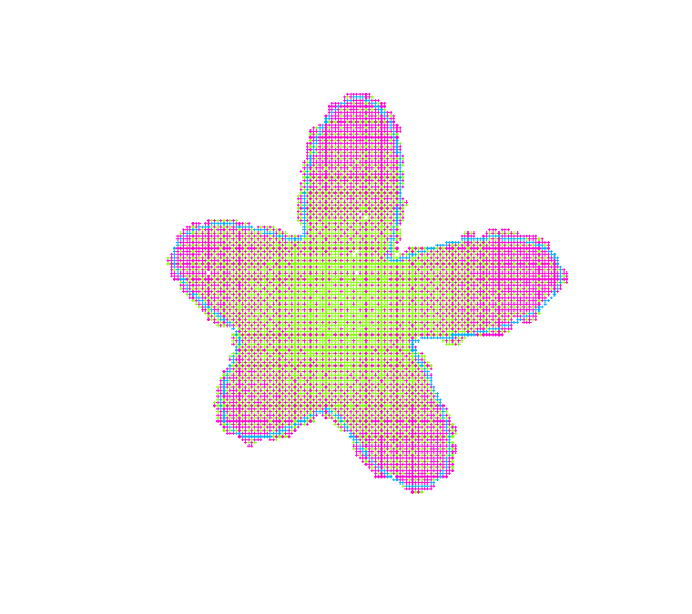

# ditherme

An interactive generative-art toy. A single colored "spore" divides and multiplies
until it swarms into a random organic shape, which is rendered as a crisp **two-tone
ordered-dither** field with a complementary outline. New forms grow endlessly, or you
can **draw your own** and watch it fill.

Everything is one self-contained `dither_artifacts.html` — no build step, no
dependencies. Just open it in a browser.

| | |
|---|---|
|  |  |
|  |  |

*Four artifacts — each a different random form, pixel style, and two-tone palette.*

---

## What's happening

1. **A shape is born.** A random closed outline is generated from a sum of radial
   harmonics (random frequencies, amplitudes, phases, elongation and rotation), so
   every form is unique.
2. **Spores multiply into it.** Starting from a single spore, each one divides —
   children spawn beside a random parent — until ~1,500 fill the shape's interior
   (found by point-in-polygon sampling).
3. **It's dithered in two tones.** Each spore carries a center→rim *mix* value,
   clamped so **both** tones always appear. The two colors are Bayer-dithered against
   each other per pixel, so every region is a crisp stipple of both — never a flat patch.
4. **A complementary outline** traces the boundary in a third color (opposite the two
   fills on the color wheel).
5. Then it dissolves and a new form grows. Forever.

The dither is computed on a small low-resolution grid and upscaled, then intersected
with a repeating **pixel-shape tile** so each dither cell can be a square, circle,
cross, diamond, and so on.

## Features

- **Endless random forms** — organic blobs, stars, flowers, gears; no two alike.
- **Two-tone Bayer dithering** with a guaranteed accent (no solid-color patches).
- **9 pixel styles** — `square`, `round`, `dot`, `diamond`, `plus`, `x`, `ring`,
  `hline`, `vline`.
- **Complementary outline** in an optional third color.
- **Draw mode** — sketch a closed loop and it fills your shape with the dither.
- **Postcard gallery** — the last 10 finished artifacts are captured as thumbnails
  down the left edge; click any to download it as a full-resolution PNG. The strip
  collapses out of the way.
- **Full control panel** — live knobs for every parameter (below).
- **PNG export** of the current frame.

## Controls

A collapsible panel (top-right) exposes everything live:

| Group | Knobs |
|---|---|
| **Shape** | cycle length · fill fraction · harmonics min/max · complexity |
| **Population** | max spores · multiply speed · motion smoothing · spore size |
| **Render** | resolution (dither pixel size) · dither scale · **pixel style** |
| **Tones** | mix floor / ceiling · boundary fuzz · outline width |
| **Colors** | random-colors toggle · Tone A / Tone B / background / outline (Tone C) |
| **Playback** | auto-cycle · **Draw mode** · New shape · Shuffle colors · Pause |
| **Export** | Download PNG · Save postcard |

### Draw mode

Click **✎ Draw mode**, then drag a loop on the canvas. On release the stroke becomes
the outline and the spores regrow to fill inside it. Draw as many as you like — each
replaces the last. Toggle it off to return to auto-cycling.

### Postcards

Snapshots are taken only when an artifact *finishes* (never every frame): one downscale
and one PNG blob, reused for both the thumbnail and its download link, held in a
10-item ring buffer so memory stays flat. Hover a card for the download button, or use
the `‹` handle to hide the strip.

## Running it

No install. Either:

- **Double-click** `dither_artifacts.html`, or
- serve the folder and open it:

```bash
python -m http.server
# then visit http://localhost:8000/dither_artifacts.html
```

## Project structure

```
ditherme/
├── dither_artifacts.html   # the whole thing — markup, styles, and canvas engine
├── README.md
└── screenshots/            # images used in this README
```

Built with vanilla JavaScript and the Canvas 2D API.
